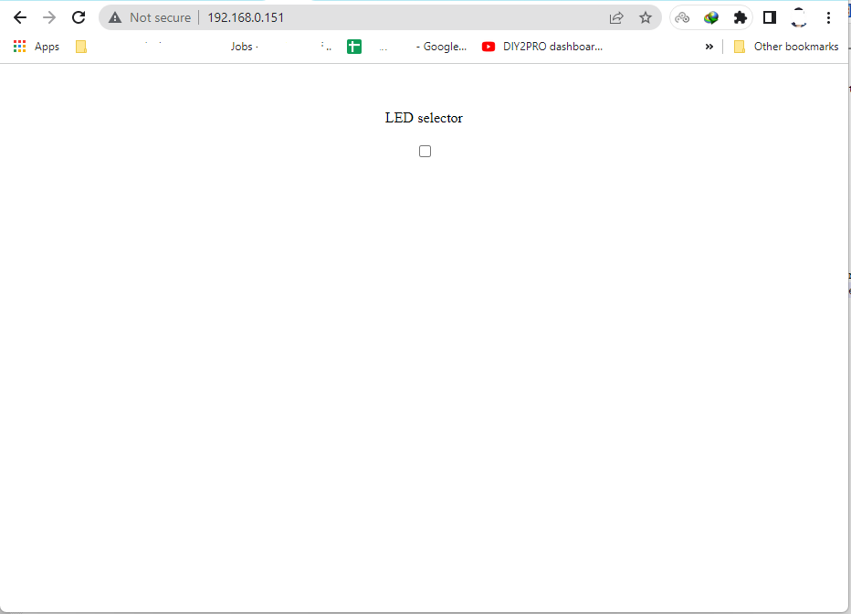

# Arduino WebServer with micro SD card

In this project we will try to setup a web server using Arduino Mega2560, Ethernet Shield by using micro SD card to control a LED and we will store html files inside our micro SD card connected to the shield.

# What parts we use for this project :

1. Arduino Mega2560 (and the LED which is embedded on board)
2. Arduino Ethernet Shield
3. USB cable (A male - B male)
4. Network switch
5. micro-SD 16GB (Which can be less even 512MB)

# How to start?

Ok, for starting you can just put the files from `SD content` folder to your micro-sd card and program your arduino with `WebServerWithSD.ino` file and now after connecting the shield to your network switch with a lan cable you can use serial monitor of arduino software to see SD initialization situation and your device ip.
Now, if you enter the IP address of your device that os shown in the serial monitor you should see a web page like below:





# HTML

Here we can check the html contents.

Template of an HTML file is like below:

```
	<html>
		<head>
		content of head
		</head>
		scripts can be inside head or body tag
		<body>
		content of body
		</body>
	</html>
```

For this project we use HTML as template to show our data and javascript to send/recieve to/from our arduino web server

By means of fetch command in javascript we send our commands as get request for toggling the led to the arduino board and using the response we change the text related to LED status

I used Serial.print() to show every request from browser to our arduino web server and show them in serial monitor

Enjoy it!